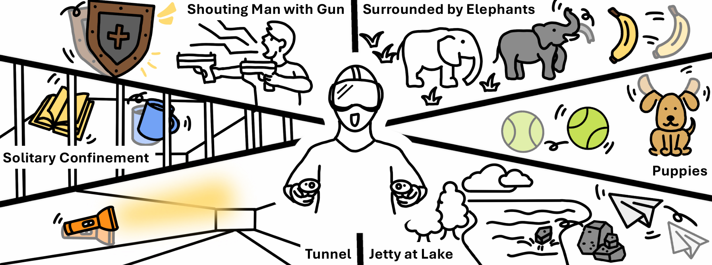
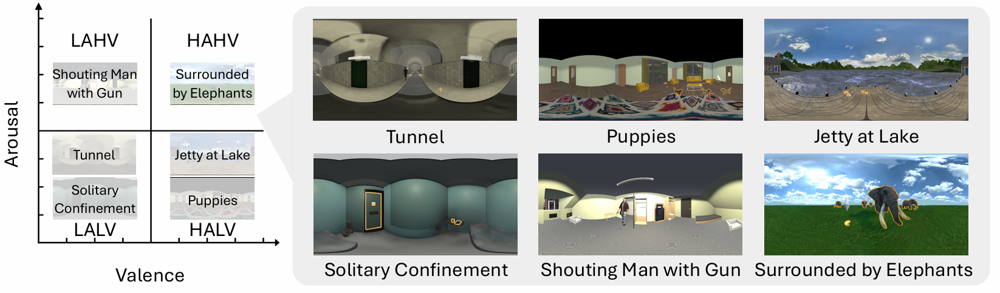
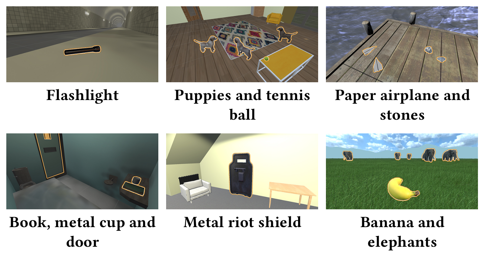

# VR-Dataset-Emotions-Interaction
This repository is for our paper published in CHI2026 "_Understanding the Effects of Interaction on Emotional Experiences in VR_".

This dataset includes:
- Sive VR scenes with affective interaction that can elicit different emotions.
- An example VR app that includes all the six scenes, including an interactive tutorial scene.
- A tool that can record the user's behavior and SAM reports.

## Targeted Emotions

Our dataset are designed to elicit target emotions to cover the four quadrants of valence–arousal as below.

## Interactive Objects

Interactive objects are highlighted when the user is within range to support discoverability. 
More detials about the interaction can be found in the paper.

## Environmnet Requirements
- Unity 6000.0.46f1 Long-Term-Support (LTS) version.
- Meta XR SDK plugin for Unity.
- VR headset: the VR app was tested on Meta Quest Pro, you may need to modify the settings for other VR devices.

## Quick Start
### Test VR Scenes
1. Download or clone this repository.
1. Load the Unity project in the `unity` folder.
1. For each scene, open the scene file in the `Assets/Scenes` folder and press the play button to test the scene.

### Test Procedure
1. Open the scene `Tutorial_Interaction`.
1. In the Hierarchy, enable the `GenerateLatinSquare` GameObject. 
1. Click Play once to generate the Latin squre for scene loading squence, and then stop and disable the GameObject.
1. Use the controller ray to select the text input field, then use the computer keyboard to enter the participant ID to start.

### [Optional] Unity Settings for Data Recording
#### Recording SAM Reports
1. SAM survey files are saved to:
 `C:\Users\YourUserName\AppData\LocalLow\VREmotion\vr-emotions-unity\SurveyData`

#### Recording User's Behavior
1. Open the corresponding scene in the `Assets/Scenes` folder.
1. Go to the `SceneController` object in the hierarchy.
1. In the `Camera Post Sender` script component，recorded JSON file are saved to: `C:\Users\YourUserName\AppData\LocalLow\VREmotion\vr-emotions-unity\CameraPoseData`
